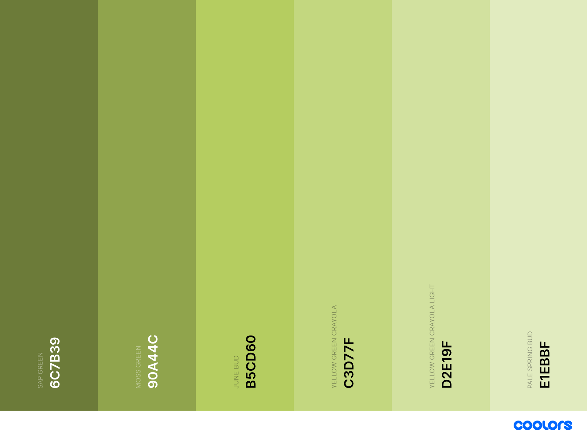

# vsc-moderate-green

**NOTICE:** This is still work in progress and may look like the standard dark color scheme.

## main color scheme

### color codes

This theme uses several base colors to get a nice green look. The main color is called _june bud_. Following colors are used:

| Name                          | hex code   |
|-------------------------------|------------|
| sap green                     | `#6c7b39`  |
| moss green                    | `#90a44c`  |
| june bud                      | `#b5cd60`  |
| yellow green crayloa          | `#c3d77f`  |
| yellow green crayloa light    | `#d2e19f`  |
| pale spring bud               | `#e1ebbf`  |

### screenshot

## additional colors

| Name              | hex code   |
|-------------------|------------|
| eerie black       | `#171717`  |
| eerie black light | `#242424`  |
| gray90            | `#e5e5e5`  |
| crimson ua        | `#a62639`  |
| crimson ua dark   | `#841e2d`  |
| crimson ua light  | `#d2929c`  |
| orange peel       | `#ff9f1c`  |
| orange peel dark  | `#cc7f16`  |
| orange peel light | `#ffcf8d`  |
| teal blue         | `#077187`  |
| teal blue dark    | `#055a6c`  |
| teal blue light   | `#83b8c3`  | 
