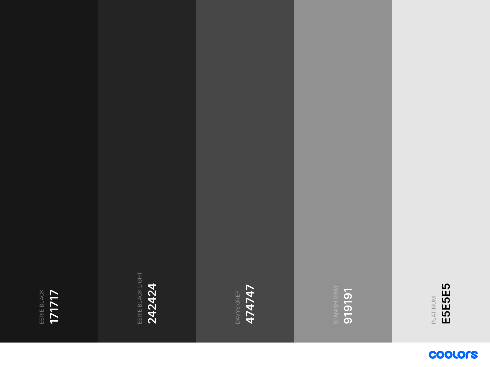

# vsc-moderate-green

**NOTICE:** This is still work in progress and may look like the standard dark color scheme.

## Main colors

This theme uses several base colors to get a nice green look. The main color is called _June Bud_. Following colors are used:

| Name                          | hex code   |
|-------------------------------|------------|
| Sap Green                     | `#6c7b39`  |
| Moss Green                    | `#90a44c`  |
| **June Bud**                  | `#b5cd60`  |
| Yellow Green Crayola          | `#c3d77f`  |
| Yellow Green Crayola Light    | `#d2e19f`  |
| Pale Spring Bud               | `#e1ebbf`  |

## Additional Colors

### Dark

| Name              | hex code   |
|-------------------|------------|
| Eerie Black       | `#171717`  |
| Eerie Black Light | `#242424`  |
| Davys Grey        | `#474747`  |
| Spanish Gray      | `#919191`  |
| Platinum          | `#e5e5e5`  |

### Red

| Name              | hex code   |
|-------------------|------------|
| Antique Ruby      | `#841e2d`  |
| Crimson UA        | `#a62639`  |
| Puce              | `#d2929c`  |

### Orange

| Name              | hex code   |
|-------------------|------------|
| Bronze            | `#cc7f16`  |
| Orange Peel       | `#ff9f1c`  |
| Deep Champagne    | `#ffcf8d`  |

### Blue

| Name              | hex code   |
|-------------------|------------|
| Blue Sapphire     | `#055a6c`  |
| Teal Blue         | `#077187`  |
| Dark Sky Blue     | `#83b8c3`  | 

